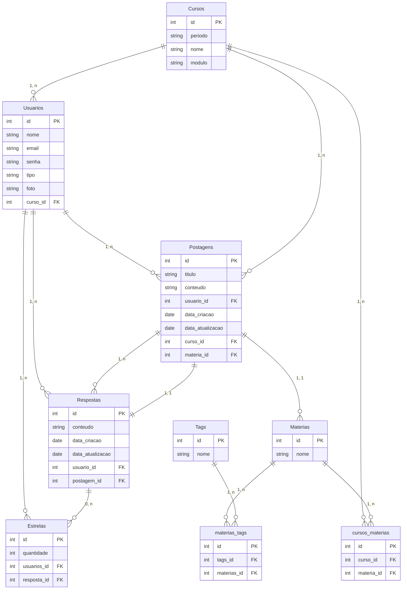

Diagrama Entidade Relacionamento 

```mermaid
erDiagram
    Usuarios {
        int id PK
        string nome
        string email
        string senha
        string tipo
        string foto
        int curso_id FK
    }

    Cursos {
        int id PK
        string periodo
        string nome
        string modulo
    }

    Postagens {
        int id PK
        string titulo
        string conteudo
        int usuario_id FK
        date data_criacao
        date data_atualizacao
        int curso_id FK
        int materia_id FK
    }

    Respostas {
        int id PK
        string conteudo
        date data_criacao
        date data_atualizacao
        int usuario_id FK
        int postagem_id FK
    }

    Estrelas {
        int id PK
        int quantidade
        int usuarios_id FK
        int resposta_id FK
    }

    Materias {
        int id PK
        string nome
    }

    Tags {
        int id PK
        string nome
    }

    cursos_materias {
        int id PK
        int curso_id FK
        int materia_id FK
    }

    materias_tags {
        int id PK
        int tags_id FK
        int materias_id FK
    }

    Usuarios ||--o{ Postagens : "1, n"
    Usuarios ||--o{ Respostas : "1, n"
    Usuarios ||--o{ Estrelas : "1, n"
    Cursos ||--o{ Usuarios : "1, n"
    Cursos ||--o{ Postagens : "1, n"
    Cursos ||--o{ cursos_materias : "1, n"
    Postagens ||--o{ Respostas : "1, n"
    Respostas ||--|| Postagens : "1, 1"
    Postagens ||--o{ Materias : "1, 1"
    Respostas ||--o{ Estrelas : "0, n"
    Materias ||--o{ materias_tags : "1, n"
    Tags ||--o{ materias_tags : "1, n"
    Materias ||--o{ cursos_materias : "1, n"
```