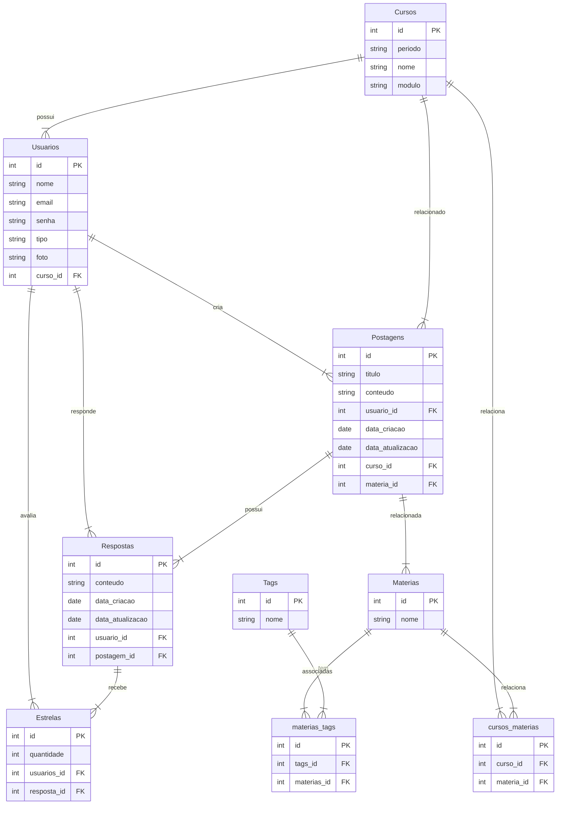

Diagrama Entidade Relacionamento 

```mermaid
erDiagram
    Usuarios {
        int id PK
        string nome
        string email
        string senha
        string tipo
        string foto
        int curso_id FK
    }

    Cursos {
        int id PK
        string periodo
        string nome
        string modulo
    }

    Postagens {
        int id PK
        string titulo
        string conteudo
        int usuario_id FK
        date data_criacao
        date data_atualizacao
        int curso_id FK
        int materia_id FK
    }

    Respostas {
        int id PK
        string conteudo
        date data_criacao
        date data_atualizacao
        int usuario_id FK
        int postagem_id FK
    }

    Estrelas {
        int id PK
        int quantidade
        int usuarios_id FK
        int resposta_id FK
    }

    Materias {
        int id PK
        string nome
    }

    Tags {
        int id PK
        string nome
    }

    cursos_materias {
        int id PK
        int curso_id FK
        int materia_id FK
    }

    materias_tags {
        int id PK
        int tags_id FK
        int materias_id FK
    }

    Usuarios ||--|{ Postagens : "cria"
    Usuarios ||--|{ Respostas : "responde"
    Usuarios ||--|{ Estrelas : "avalia"
    Cursos ||--|{ Usuarios : "possui"
    Cursos ||--|{ Postagens : "relacionado"
    Cursos ||--|{ cursos_materias : "relaciona"
    Postagens ||--|{ Respostas : "possui"
    Postagens ||--|{ Materias : "relacionada"
    Respostas ||--|{ Estrelas : "recebe"
    Materias ||--|{ materias_tags : "tem"
    Tags ||--|{ materias_tags : "associadas"
    Materias ||--|{ cursos_materias : "relaciona"
```